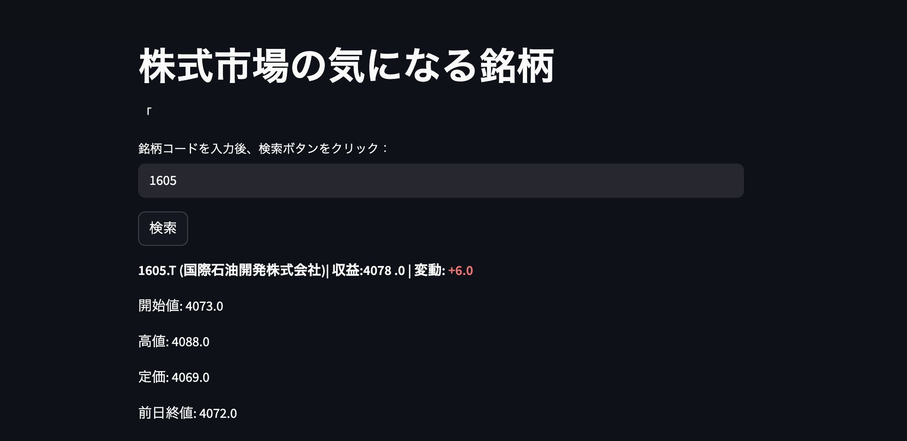
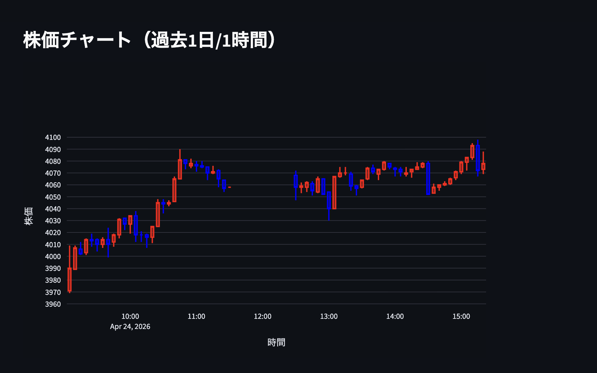

# 株価チェックアプリ
## 作成動機
趣味で株投資を行っている中でデイトレードにも興味を持ち、保有している
個別株の情報を可視化できるツールを自身でゼロから作ってみたい。

## 概要
株価確認アプリです。
銘柄コードを入力するだけでリアルタイムに近い株価とローソク足チャートを確認できます。

## スクリーンショット

## 使用技術
- フロントエンド：Streamlit
- バックエンド：Python
- データ取得：yfinance
- グラフ描画：Plotly
- バージョン管理：Git / Github

## 機能一覧
- 銘柄検索（証券コード入力）
- 直近株価の表示
- 前日比・差額の表示
- ローソク足チャートの表示（５分足）

## 工夫した点
- 前日比を直感的に把握できるようプラスの場合は赤、マイナスの場合は青で色分け表示
- 日本株に対応するため、銘柄コード入力時に".T"を自動付与する処理を実装;
- 営業日ベースでのデータ取得を考慮した実装

## 今後の改善
- 複数銘柄の同時比較機能
- Anthropic APIを活用した銘柄分析コメントの自動生成
- アラート機能（指定価格に達した場合に通知）

## 注意事項
※データはyfinanceの仕様により約１５〜２０分遅延します

